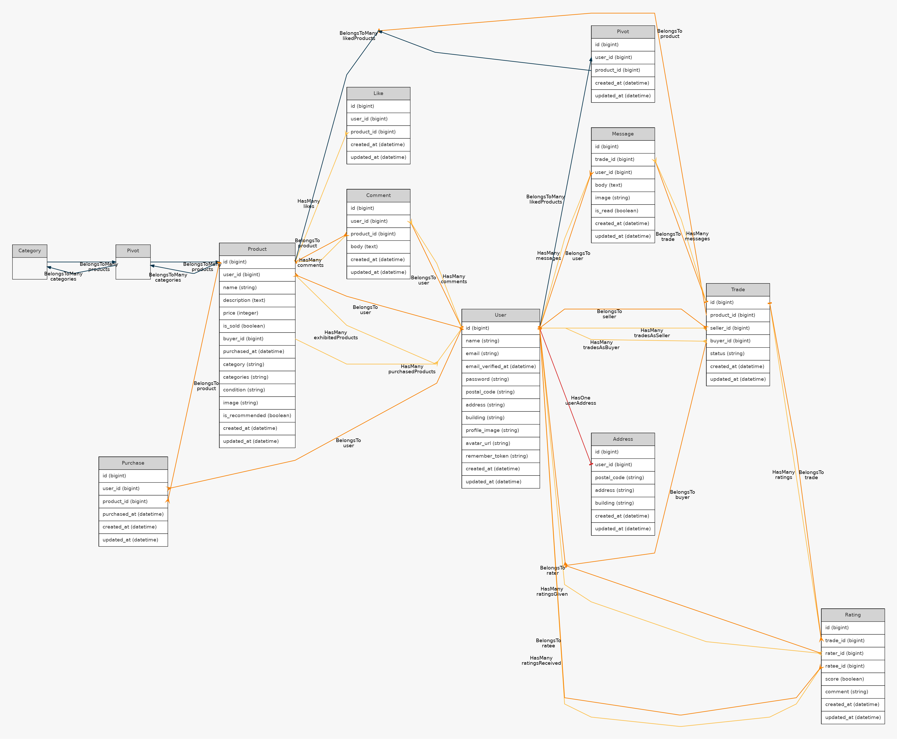

────────────────────────────
■ 環境構築
────────────────────────────

1. clone

git clone git@github.com:haru268/fleamarketapp01.git
cd fleamarketapp01

2. 環境ファイル

cp .env.example .env  

3. Docker

docker-compose up -d --build

4. 依存ライブラリ

docker-compose exec php composer install

5. アプリキー & DB

docker-compose exec php php artisan key:generate

docker-compose exec php php artisan migrate:fresh --seed

Mailhog でメール確認 → http://localhost:8025

phpMyAdmin → http://localhost:8080

────────────────────────────
■ 主要 URL 一覧
────────────────────────────

トップ（商品一覧）	http://localhost/

ユーザー登録	http://localhost/register

ログイン	http://localhost/login

Mailhog	http://localhost:8025

phpMyAdmin	http://localhost:8080

────────────────────────────
■　ダミーユーザー
────────────────────────────

email	password	備考

user1@example.com	password	出品者

user2@example.com	password	購入者

lonely@example.com	password	テスト用

────────────────────────────
■　その他
────────────────────────────

 自動テスト（PHPUnit）

初回のみ：テスト DB 作成

docker-compose exec mysql \

  mysql -uroot -proot -e "CREATE DATABASE IF NOT EXISTS laravel_test CHARACTER SET utf8mb4 COLLATE utf8mb4_unicode_ci;"

テスト実行

docker-compose exec php php artisan test

Seeder 概要

UsersTableSeeder … ユーザー3名

ProductsTableSeeder … 課題指定 10 商品 (CO01–CO10)

php artisan migrate:fresh --seed で再現可能

────────────────────────────
■ 使用技術
────────────────────────────

PHP 7.4.9 / Laravel 8.83.29 / MySQL 8.0.26 / Docker / Fortify / PHPUnit

────────────────────────────
■ ER 図
────────────────────────────

